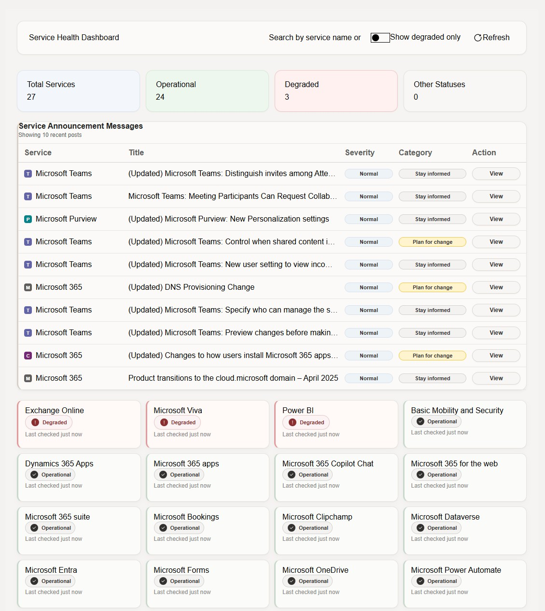
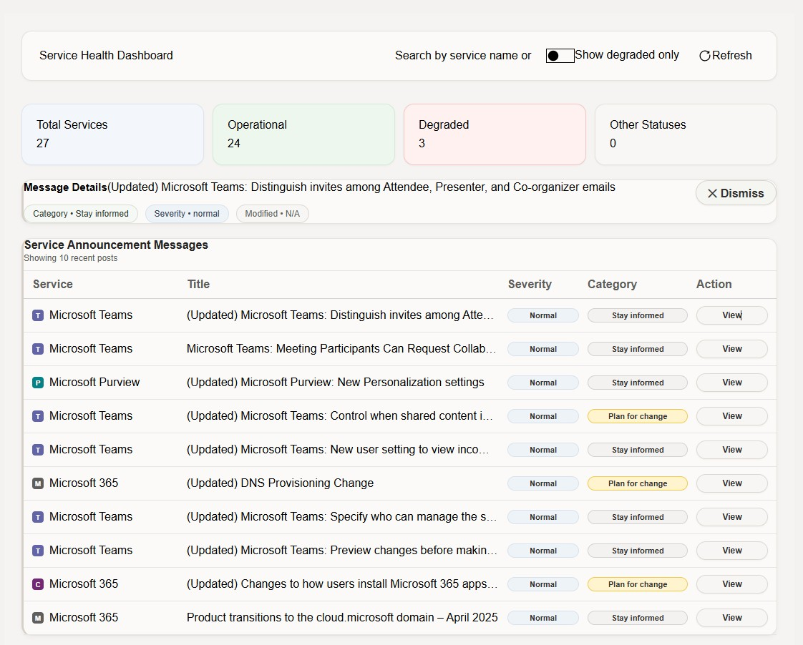
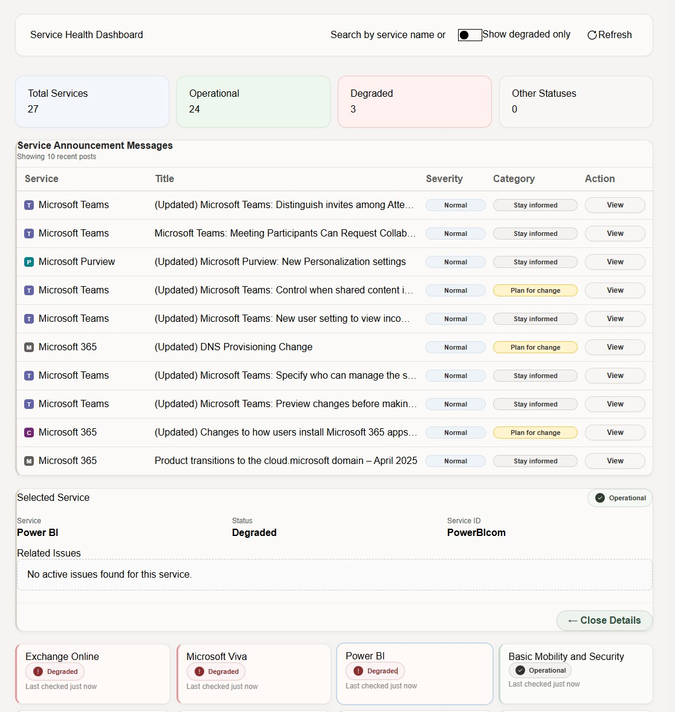
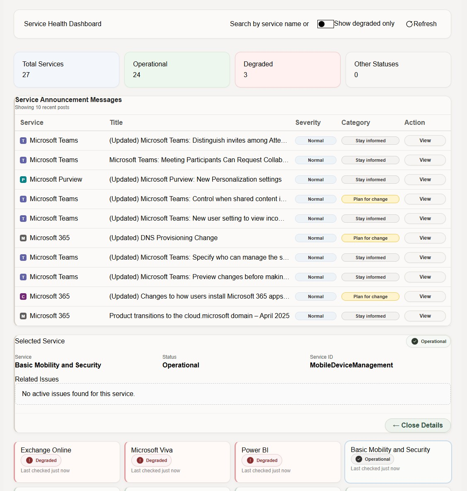
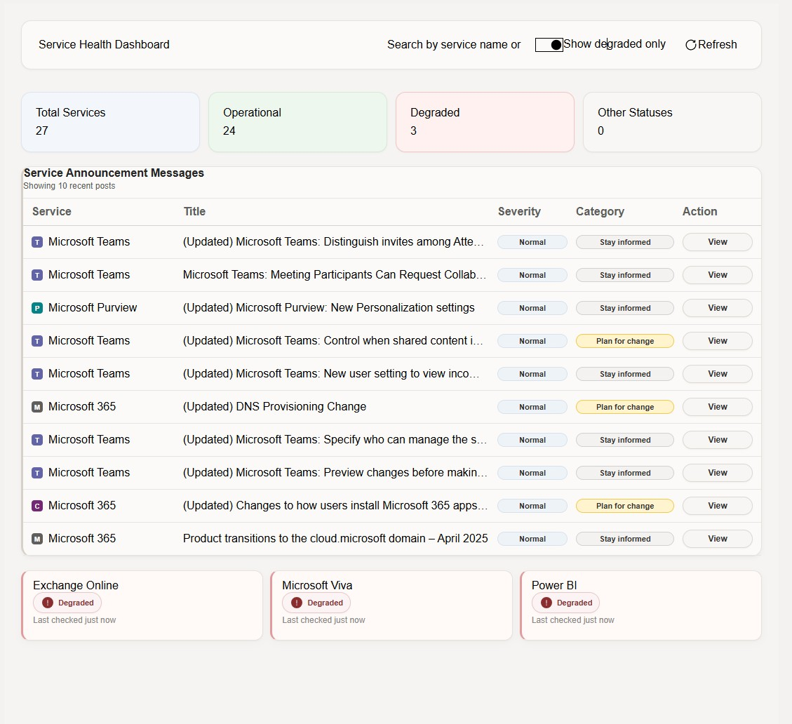

# SPFx Service Health Dashboard

SharePoint Framework (SPFx) dashboard using Microsoft Graph to display Microsoft 365 service health and service announcements.

## Features

- Service Health Overview (Operational / Degraded / Other)
- Microsoft 365 Service Status Cards
- Service Announcement Messages
- Message Details Panel
- Related Issue Details
- Search and Filter Services
- Show Degraded Only Toggle
- Manual Refresh
- Responsive Fluent UI interface
## Screenshots

### Service Health Overview


### Message Center


### Selected Service Details


### Message Center Details


### Related Issues View


## Tech Stack

- SharePoint Framework (SPFx)
- React
- TypeScript
- Fluent UI v9
- Microsoft Graph
- Node.js
- Express
- MSAL Authentication

## Microsoft Graph Endpoints Used

```http
/admin/serviceAnnouncement/healthOverviews
/admin/serviceAnnouncement/issues
/admin/serviceAnnouncement/messages
/admin/serviceAnnouncement/messages/{id}
```

## Architecture

SPFx Frontend

- Dashboard UI
- Service cards
- Message center view
- Selected service detail panel

Node API Backend

- Graph authentication
- Graph proxy routes
- Service health retrieval

## Setup

Clone repository:

```bash
git clone https://github.com/Joce2326/spfx-service-health-dashboard.git
```

Install dependencies:

```bash
npm install
```

Create `.env` file from:

```bash
.env.example
```

Run API:

```bash
node server.js
```

Run SPFx:

```bash
gulp serve
```

## Environment Variables

```env
CLIENT_ID=
TENANT_ID=
CLIENT_SECRET=
PORT=3000
```

Do not commit `.env`.

## Future Improvements

- Incident trend charts
- Service Health history
- Teams notifications
- Copilot incident summaries
- Azure Function integration

## Author

Jocelyn Zavala Fara
